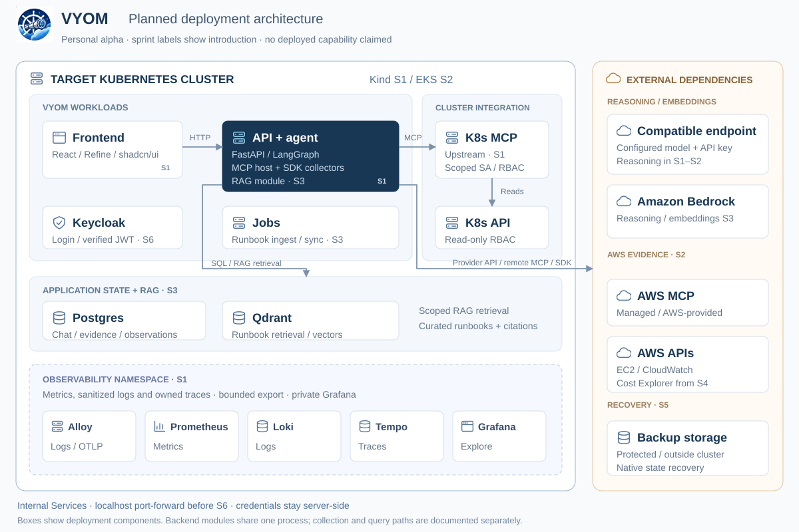

  

<h1 align="center">Vyom</h1>

A progressively built AWS + Kubernetes intelligence cockpit: ask a question, inspect live read-only evidence, and understand the answer.

**Current state:** the main roadmap remains at documentation and architecture planning. A separate [two-Kind-cluster chat POC](poc/kind-chat/README.md) provides a shadcn UI, direct Kubernetes reads, a LangChain backend using an OpenAI-compatible model and Helm packaging. Its code checks pass; deployment and live integrations remain owner-run and unverified. It gives no S1–S6 completion credit.

## Planned service overview

The planned deployment runs on Kind in S1 and EKS in S2. Service groups distinguish application workloads, cluster integration, persistent state, observability and external dependencies. Sprint labels show when each component enters the plan.

[Open full-size diagram](docs/diagrams/readme-architecture.svg) · [Detailed architecture and request paths](docs/ARCHITECTURE.md) · [Observability collection topology](docs/OBSERVABILITY.md#collection-topology)

FastAPI, LangGraph, the MCP host and deterministic collectors share one backend workload. Chat explores through upstream MCP integrations; inventory uses direct SDKs. Postgres and Qdrant use normal clients, while jobs reuse backend libraries. The model provider is explicitly configured, with Bedrock introduced in S3. **RAG starts in S3 inside the backend:** jobs ingest curated runbooks using Bedrock embeddings, Qdrant retrieves relevant sections, and LangGraph combines that guidance with live evidence using distinct citations.

The diagram shows primary connections; placement identifies deployment ownership. Observability starts in S1, with bounded exports and private Grafana access. Access stays private through localhost port-forwarding before S6; backend membership/grant policy supplies authority after Keycloak verifies identity.

| Workload / dependency | Responsibility | Starts |
|---|---|---|
| Frontend Deployment | Chat, evidence panels and deterministic resource views | S1 |
| FastAPI backend Deployment | Trusted context, agent, MCP client, SDK collectors and evidence; RAG/history added S3 | S1 |
| Upstream Kubernetes MCP Deployment | Read-only cluster exploration with its own scoped provider identity | S1 |
| Prometheus, Loki, Tempo, Grafana and Alloy | Metrics, sanitized logs, traces and private operational dashboards | S1 |
| Remote AWS MCP + direct AWS SDK | Agent exploration and independent inventory/metrics | S2 |
| Postgres / Qdrant / observation and ingest jobs | Scoped durable evidence/history and curated retrieval | S3 |
| Bedrock | Reasoning and separately configured embeddings | S3 |
| External backup destination | Native state recovery outside the cluster | S5 |
| Keycloak | Login and verified user identity; membership/grants remain backend policy | S6 |

One Vyom application chart and pinned vendor observability releases share a reproducible environment workflow. Optional Jev classification in S4 and conditional Vault in S6 are described in the [architecture](docs/ARCHITECTURE.md); they are not mandatory service dependencies. See the [interactive application overview](docs/diagrams/application.html), [interactive observability view](docs/diagrams/observability.html) and [observability design](docs/OBSERVABILITY.md) for further detail and verification limits.

## Start here

1. [Constitution](vyom-12-week-sprint-plan.md) — scope and six-sprint delivery order.
2. [Agent agreement](AGENTS.md) — how coding sessions work.
3. [Implementation plan](docs/IMPLEMENTATION_PLAN.md) — task details and acceptance.
4. [Tracker](docs/TRACKER.md) — authoritative task status and evidence.
5. [Current handoff](docs/HANDOFF.md) — where the next session starts.
6. [Architecture](docs/ARCHITECTURE.md) — intended S6 design and detailed diagrams.
7. [Verification](docs/VERIFICATION.md) — what constitutes proof.
8. [MCP integrations](docs/MCP_INTEGRATIONS.md) — upstream ownership, dual execution paths and deployment/auth gates.
9. [Observability](docs/OBSERVABILITY.md) — S1 metrics/logs/traces topology, privacy and live gates.
10. [Branding](docs/BRANDING.md) — canonical logo and reuse for the application, documents and future site.
11. [Decisions](docs/DECISIONS.md) — open choices and accepted implementation decisions.

First milestone: on Kind, ask which pods are unhealthy in a demo namespace and receive an answer citing the upstream Kubernetes MCP server through Vyom’s MCP client; the resource view uses a direct SDK path. The same real chat must expose Prometheus metrics, sanitized Loki logs and an OTel/Tempo trace through privately accessed Grafana. S1 adds 10 estimated hours; the aggregate is 12.5 weeks at current capacity, with twelve weeks still the target. No runtime setup commands exist yet; S1 will introduce and verify them.
