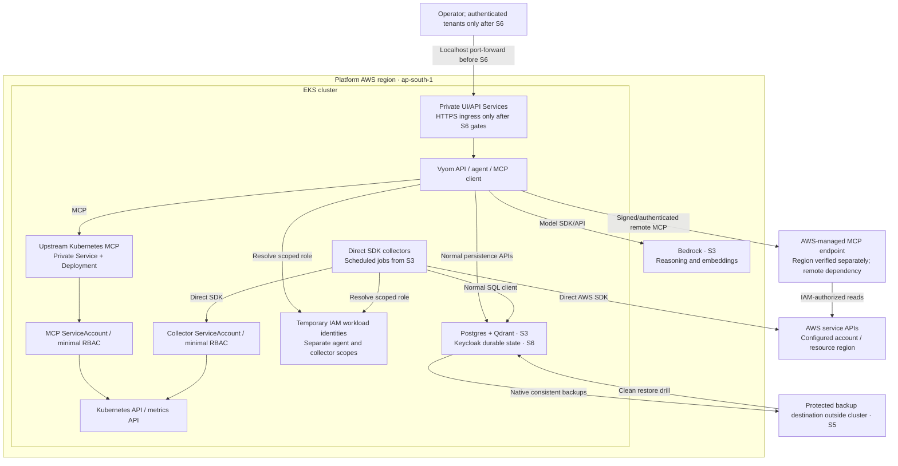
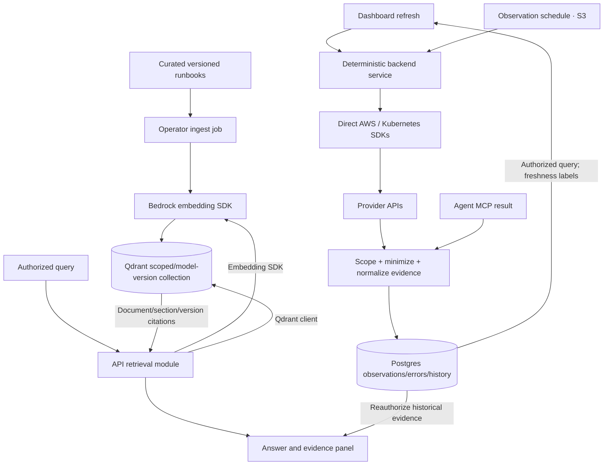
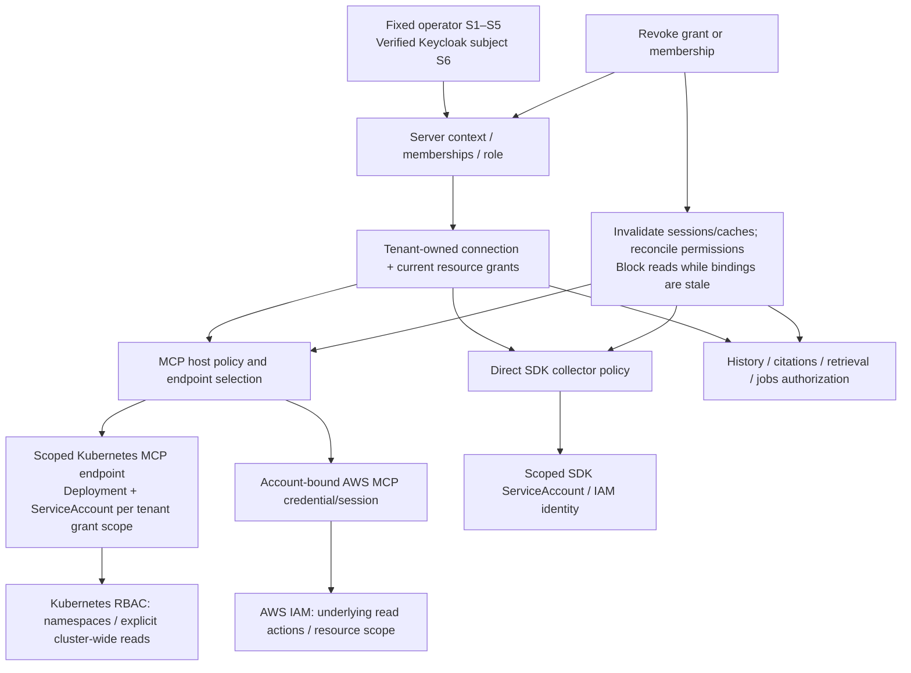

# Vyom — intended end-of-S6 architecture

**Design target, not deployed state.** The 12-week outcome remains a personal alpha with a tested initial tenant boundary. The reset remains in force. This revision adopts the owner's MCP host/client decisions while preserving the existing sprint order, frontend stack, inference progression, RAG, recovery and later Keycloak.

The [interactive overview](diagrams/application.html) and [editable JSON](diagrams/application.json) show the two execution paths. See [verification status](diagrams/README.md) for rendering limits and [MCP integration design](MCP_INTEGRATIONS.md) for the detailed deployment/authentication matrix and primary sources. Diagrams below are editable Mermaid source.

## 1. Components and responsibilities

```mermaid
flowchart TB
    ui[Vyom UI / future CLI<br/>Ordinary backend API client]
    subgraph backend[Vyom backend / FastAPI]
        auth[Server context and authorization<br/>Fixed operator initially; Keycloak memberships S6]
        graph[Agent / LangGraph<br/>Bounded reasoning and tool selection]
        host[MCP client / host<br/>Connection registry, policy, credentials, evidence]
        deterministic[Deterministic product logic<br/>Inventory, sync, dashboards, calculations]
        persistence[Persistence / RAG modules<br/>Normal libraries and APIs]
        auth --> graph --> host
        auth --> deterministic
        graph --> persistence
        deterministic --> persistence
    end
    subgraph target[Target Kubernetes cluster]
        kmcp[Upstream Kubernetes MCP Deployment<br/>Preferred containers/kubernetes-mcp-server]
        kapi[Kubernetes API<br/>Scoped RBAC]
        kmcp -->|In-cluster ServiceAccount| kapi
    end
    awsMCP[AWS-managed MCP Server<br/>Or verified appropriate AWS-provided capability]
    aws[AWS APIs<br/>Read-only IAM]
    pg[(Postgres · S3)]
    q[(Qdrant · S3)]
    model[Reasoning endpoint<br/>Compatible API S1; Bedrock S3]
    future[Later registered MCP servers<br/>GitHub, IaC, docs, FinOps]
    ui -->|HTTP API| auth
    graph -->|Model SDK/API| model
    host -->|Authenticated MCP| kmcp
    host -->|Authenticated remote MCP| awsMCP
    awsMCP -->|Scoped AWS identity| aws
    deterministic -->|Direct Kubernetes SDK| kapi
    deterministic -->|Direct AWS SDK| aws
    persistence -->|SQL client| pg
    persistence -->|Qdrant client| q
    host -.->|Later, separately gated| future
```

Vyom owns orchestration and integration policy. It does not build a production Kubernetes MCP protocol implementation or a general-purpose AWS MCP server. The upstream Kubernetes server is a separate pinned workload, not a Vyom Python entrypoint. An AWS signing proxy, if needed, is transport support for the host rather than a cloud-tool wrapper.

Deterministic product services handle bulk/paginated collection, schedules, arithmetic, dashboards and persistence through normal SDKs/APIs. MCP is the preferred boundary for agent-driven exploration. Both paths produce a shared evidence contract, with distinct provenance. A table must not become unavailable merely because an independent MCP integration failed.

The UI/CLI never selects upstream credentials or contacts MCP directly. The CLI is shown as a future client, not added to S1. Postgres, Qdrant, embeddings, internal APIs and application logic are not routed through MCP. Optional additional servers remain future integrations, not new six-sprint tasks.

## 2. Deployment topology: local KIND and EKS

### Local KIND — S1

```mermaid
flowchart LR
    dev[Developer browser<br/>localhost only]
    model[Configured compatible model endpoint]
    subgraph kind[KIND cluster · same cluster monitored first]
        ui[UI Deployment / internal Service]
        subgraph app[Vyom API Deployment]
            graph[LangGraph + MCP client]
            sdk[Direct pod SDK projection]
        end
        svc[Private authenticated MCP endpoint<br/>ClusterIP Service for HTTP]
        upstream[Upstream Kubernetes MCP Deployment<br/>Pinned image + read-only config]
        msa[Dedicated MCP ServiceAccount<br/>Demo namespace Role/RoleBinding]
        csa[Separate collector ServiceAccount<br/>Scoped read permissions]
        kapi[Kubernetes API]
        demo[Demo namespace / test pods]
        ui -->|Normal HTTP API| app
        graph -->|MCP over chosen secure transport| svc
        svc --> upstream
        upstream -->|In-cluster credentials| msa
        msa --> kapi
        sdk --> csa --> kapi
        kapi --> demo
    end
    dev -->|Localhost port-forward| ui
    graph -->|Backend-only model key| model
```

The MCP endpoint is private and authenticated without requiring early Keycloak. Prefer supported Streamable HTTP; the Service is conditional on network transport. If an existing authentication/TLS proxy is selected, the raw server port must not bypass it. The MCP server uses its ServiceAccount for Kubernetes API access; do not forward a frontend token as Kubernetes authority. No developer-admin kubeconfig is mounted.

S1 acceptance covers Deployment, Service when needed, ServiceAccount, minimal RBAC, read-only tool selection, safe config/credential mounts, probes/resources, sanitized logs and connection health. NetworkPolicy is optional end-of-roadmap hardening; if added, verify CNI enforcement rather than claiming security from YAML alone. Secret access, writes, exec and raw logs remain disabled. The deterministic collector has its own scoped identity. Endpoint/image/config compatibility and actual safe tool outputs must be proven before the live gate.

### EKS — S2 onward, with S3/S6 additions labelled



AWS-managed MCP is outside the EKS deployment, not a pod or custom wrapper. Endpoint region is distinct from the platform and monitored-resource region; source checks currently list a `us-east-1` managed endpoint. S2 verifies availability, routing/data handling, credentials and capability coverage before activation. See [AWS endpoint reference](https://docs.aws.amazon.com/general/latest/gr/aws-mcp.html).

Kind and EKS share chart structure and pinned upstream version with environment-specific values. Kubernetes RBAC and AWS IAM are different authorization systems. IRSA for AWS credentials does not grant Kubernetes reads. Bedrock reasoning/embedding permissions start S3; AWS MCP uses its own verified connection authentication and least-privilege scope. Observability is basic from S1, expands in S2 and is hardened in S5.

The full Kubernetes deployment checklist and credential matrix live in [MCP_INTEGRATIONS.md](MCP_INTEGRATIONS.md). S6 initially isolates upstream Deployments/ServiceAccounts by tenant grant scope. No remote-cluster enrollment, broad service mesh, generic gateway or multi-region platform is introduced.

## 3. Question-to-evidence sequence

```mermaid
sequenceDiagram
    actor U as User
    participant API as Vyom backend
    participant G as LangGraph
    participant L as Model adapter
    participant H as MCP host/client
    participant K as Upstream Kubernetes MCP
    participant A as AWS-managed MCP
    participant P as Provider API
    participant R as Normal persistence/RAG APIs
    U->>API: Question + resource filters; JWT only S6
    API->>API: Resolve fixed context or verified membership/grants
    API->>G: Authorized context and budgets
    G->>L: Supported question + allowed tool schemas
    L-->>G: Untrusted proposed tool and arguments
    G->>H: Request registered capability
    H->>H: Validate scope, operation, endpoint binding and budgets
    alt Kubernetes investigation
        H->>K: Authenticated MCP call to authorized endpoint
        K->>P: Kubernetes API read with scoped ServiceAccount
        P-->>K: Resources or denied/partial/error
        K-->>H: Upstream result
    else AWS investigation
        H->>A: Remote MCP with scoped temporary identity
        A->>P: AWS API read under IAM
        P-->>A: Resources or denied/partial/error
        A-->>H: Upstream result
    end
    H->>H: Minimize and normalize evidence; reject unsafe output
    H-->>G: Source, time, coverage, evidence IDs and limitations
    opt Runbook guidance / history from S3
        G->>R: Scoped retrieval via normal libraries
        R-->>G: Authorized document/history evidence
    end
    G->>L: Observations and guidance as data, not instructions
    L-->>G: Facts / hypotheses / next checks with citations
    G->>G: Validate referenced evidence IDs and limits
    G->>R: Persist through normal SQL API from S3
    G-->>API: Answer and inspectable evidence
    API-->>U: Grounded response or explicit limitation
```

The host resolves authority before any upstream call. Neither managed AWS MCP nor the Kubernetes upstream is assumed to interpret Vyom tenant IDs. RBAC/IAM enforce provider scope; host policy constrains capabilities, arguments, evidence and user access. Missing authorization prevents calls altogether. Provider/MCP failure yields an explicit integration limitation; a direct-SDK fallback must be intentional, labelled and cannot pass an MCP acceptance gate.

S1 has one bounded tool round; S4 allows bounded sequences across registered capabilities. Model-provider integration remains a separate SDK/API path, preserving the original S1 compatible-model and S3 Bedrock milestones. MCP tool output is untrusted, even when the tool is supplied upstream.

## 4. Deterministic collection, knowledge and persistence



Database, vector, schedule and ordinary service communication never require an MCP round trip. Direct collectors and agent evidence meet at a normalized contract, not at a new universal protocol server. Record transport/provenance so observations from different collection times are not treated as contradictory automatically. Deterministic findings/calculations stay in code.

Retain original S3 requirements: idempotent chunk IDs and ingest, model/dimension-version collections and reindexing, fresh migration ledger, workspace scope, observation idempotency and explicit stale/error records. Postgres is not a metrics time-series replacement. Curated retrieval remains inside the API; no upload/crawler or separate RAG service is added.

## 5. Authentication, authorization and connection isolation



There are distinct identities: the user accessing Vyom, Vyom authenticating to an MCP endpoint, and the endpoint accessing a provider API. Keycloak resolves the first only in S6. In-cluster ServiceAccount credentials resolve the Kubernetes provider identity from S1. An endpoint token must not accidentally change the provider identity. AWS calls use verified temporary workload/account scope; do not copy preview-era policies without checking current AWS guidance.

The initial tenant gate uses isolated Kubernetes MCP deployments/ServiceAccounts per distinct tenant grant scope rather than a shared overprivileged endpoint. No additional upstream protocol implementation is needed. Revocation must affect live calls, pooled sessions, deterministic jobs and stored evidence. Client/model tenant headers, namespace arguments, server URLs and credential profiles never grant authority. A read-only setting or tool annotation is insufficient without effective RBAC/IAM and output minimization.

Viewer/operator roles govern product actions; all cloud and Kubernetes operations in these six sprints remain read-only. Later writes require a separate explicit policy/use case. Future GitHub/IaC/documentation/FinOps MCP connections use the same registered-client boundary and receive their own permission and data-handling review.

## 6. Optional external classifier and secret storage

```mermaid
flowchart LR
    request[Authorized request text] --> gate{Jev enabled and<br/>data-handling gate passed?}
    gate -->|No| graph[Core Bedrock workflow]
    gate -->|Yes| redact[Minimize / redact<br/>Exclude credentials, identity,<br/>tool results and retrieved context]
    redact --> gateway[Vercel AI Gateway → actual Jev]
    gateway --> validate[Validate typed category + confidence]
    validate -->|Known and sufficient confidence| hint[Routing hint only]
    validate -->|Unknown / failure / uncertainty| graph
    hint --> graph
    graph --> auth[Normal code-based authorization<br/>and calculations remain mandatory]
```

Jev is evaluated in S4, disabled by default, and never necessary for the core journey. Geography, retention and minimization must pass before activation. The initial S1 compatible reasoning provider and this optional classifier are separate data-processing paths with separate configuration and checks.

Vault is conditional in S6 if additional connection secrets justify it; it is not a mandatory S1 deployment. Early model keys use a private runtime injection mechanism. AWS workload IAM roles avoid embedding AWS keys in application configuration. Secret segregation and rotation must be verified for whichever S6 mechanism is selected.

## 7. How the architecture grows

| Stage | New capability | New runtime/state complexity |
|---|---|---|
| S1 | One live pod question, table, citations | UI + API/agent with MCP client + upstream in-cluster Kubernetes MCP; direct pod view |
| S2 | EC2, workload health and current metrics | Same release/upstream K8s MCP on EKS; remote AWS-managed MCP plus direct SDK paths |
| S3 | Bedrock reasoning, curated guidance and memory | Postgres + Qdrant; operator ingest and observation job; embedding adapter |
| S4 | Bounded investigation, daily cost and two findings | Additional upstream capabilities/graph paths; optional Jev classifier |
| S5 | Recovery, fault handling and release confidence | Backup destination, operational telemetry and automation |
| S6 | Tested membership and namespace isolation | Keycloak, connection/credential isolation, scoped upstream deployments and conditional Vault/HTTPS exposure |

No Azure/GCP provider APIs, remote-cluster enrollment, event streaming pipeline, Security Hub platform, compliance, SBOM, alerts or generic monitoring system is implied by the final design. Those remain outside the constitution's core timebox.
