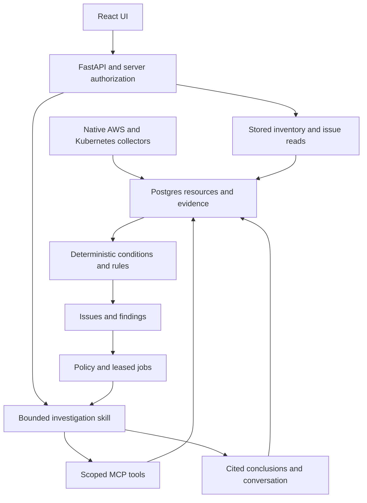

# Vyom architecture

Design target: a continuous AWS + Kubernetes operations station with Inventory, Investigation and Security. [Tracker](TRACKER.md) records implementation status; this document defines boundaries, not deployed capability.

## Components and paths

React/Refine/shadcn UI calls one FastAPI application. Native collectors maintain normalized resources, relationships, collection runs and evidence in Postgres. Read APIs serve stored state; browsing does not initiate an environment-wide provider scan. Configurable scheduling is independent of the UI and model.

Deterministic change/health/security rules evaluate authorized observations and create findings or issue episodes. A scoped trigger policy schedules bounded investigation jobs. Postgres leases and idempotent attachment support crash recovery; no broker is required. The same investigation skill serves user questions and automatic triage. Inventory supplies context, authorized tools verify missing/stale facts, and conclusions cite stored evidence.

```mermaid
flowchart TB
    ui[React UI] --> api[FastAPI and server authorization]
    api --> reads[Stored inventory and issue reads]
    native[Native AWS and Kubernetes collectors] --> store[Postgres resources and evidence]
    store --> rules[Deterministic conditions and rules]
    rules --> issues[Issues and findings]
    issues --> jobs[Policy and leased jobs]
    api --> skill[Bounded investigation skill]
    jobs --> skill
    skill --> tools[Scoped MCP tools]
    tools --> store
    reads --> store
    skill --> results[Cited conclusions and conversation]
    results --> store
```

## Domain boundaries

Resource identity includes workspace, authorized connection and native incarnation identity; names are lookup aliases, not durable identity. Relationships are scoped rows with source/target, type, verification time and evidence. Retain observations separately from latest state. Collection coverage governs reconciliation: failed/partial scans cannot mark absent resources or resolve issues.

Issue state is independent from investigation state. Model/tool failures leave deterministic evidence visible. Fresh recovery evidence or explicit operator disposition closes an episode; model conclusions cannot. See [continuous operations](CONTINUOUS_OPERATIONS.md) for exact lifecycle and race handling.

Security findings are deterministic, versioned rule results. Preserve category, policy parameters, evidence, remediation and framework metadata. External detections retain source confidence and are not automatically confirmed incidents. No SIEM or telemetry backend is part of this architecture.

## Integration and authorization

MCP is the agent-facing boundary, not inventory transport. Reuse pinned upstream Kubernetes MCP and suitable AWS-provided integrations; no custom general MCP server. Direct collectors use separate provider identities. Host validation and provider RBAC/IAM both enforce scope, argument/result projections and budgets. Scoped sessions, current grants and credential isolation apply to background jobs and historical data as well as live requests.

Postgres and internal libraries use normal clients. The initial model is explicitly configured behind the existing adapter; switching providers is a tested separate change. Document RAG/vector storage is deferred. Prometheus can supply health evidence; Grafana/Loki/Tempo/Alloy are optional operational tooling.

## Deployment and failure behavior

One application chart on Kind packages the API/UI and pinned upstream MCP with private auth. Add Postgres and a small worker using the application image when their consuming tasks land. Keep Services internal and access localhost-only until the identity/recovery gate. [Local setup](LOCAL_DEVELOPMENT.md) describes actual profiles and implementation limits.

Inventory remains usable when model/MCP services fail. Stale observations are explicit when collection fails. Durable jobs use bounded retries/leases; lost telemetry must never block requests. Credential values, provider payloads, questions and answers never enter routine logs or metrics. [Verification](VERIFICATION.md) defines evidence requirements.

The [diagram index](diagrams/README.md) links the current README architecture image and historical interactive references. Old RAG/cost/sprint layouts do not govern this design.
