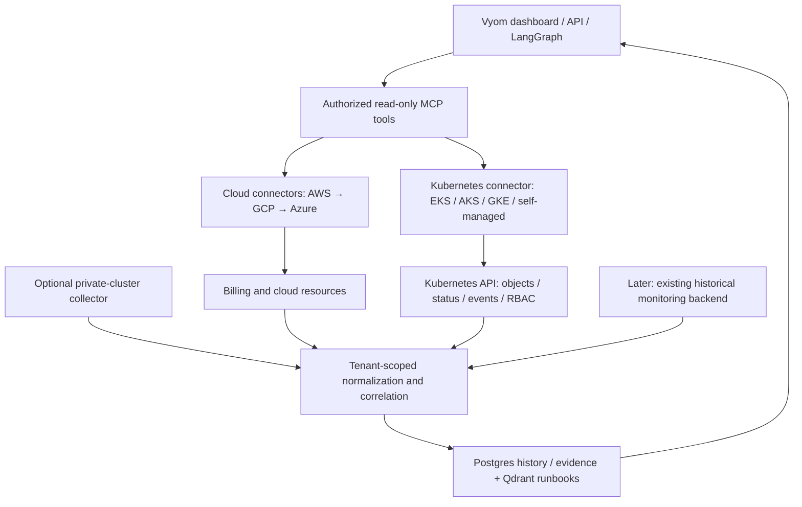

# Vyom — Kubernetes coverage

The owner expanded the first release on 2026-10-03. Kubernetes is a distinct
collection path for EKS, AKS, GKE, and self-managed clusters. Cloud connectors
collect infrastructure and billing; the Kubernetes connector collects clusters,
objects, workload status/events, and configuration evidence. This is planned
scope, not a claim that these adapters are already running. B11 in the execution
tracker contains the implementation and acceptance gates.

## Implemented internal preparation (B1.9)

`mcp-server/connectors/kubernetes/` now implements an internal
`KubernetesOperations.inspect(context, connection, grant)` flow. `context` and
`grant` must be constructed by trusted backend identity/membership resolution;
they are not wire request models and must never be deserialized from tool inputs.

- A closed resource registry supplies namespaced list URLs and explicit
  cluster-wide kinds. No all-namespace reads followed by filtering; no Secret,
  exec/attach, proxy or mutation endpoints.
- An HTTPS GET transport validates the enrolled host, disables redirects and
  environment proxies, verifies the supplied CA, reads the token on each call,
  limits response size, and exposes only controlled failure categories. Credential
  files are scoped under `/etc/secrets/tenants/{tenant}/clusters/{cluster}/`.
- Paginated collection deduplicates UID keys, limits pages/object counts, and
  preserves incomplete/denied/unsupported coverage. Normalization projects
  specific metadata, status and configuration fields; it excludes annotations,
  env values, commands/args, Secret data and free-form event/error messages.
- Topology links observed owners, pods/nodes, Services/pods and PVC/PV evidence
  inside the same tenant/cluster/namespace boundaries. Node provider IDs remain
  unresolved references; there is no implemented cloud-account join yet.
- Health distinguishes unknown, attention, healthy and completed observations;
  stale workload generations stay unknown. Bounded posture checks cover host
  access, privileged/escalation flags, wildcard RBAC, cluster-admin bindings,
  potential external Services and missing namespace policies only when collection
  is complete. These are indicators, not proof of external reachability,
  packet isolation or formal compliance.
- In-memory reconciliation returns tombstone keys only for completely collected
  scopes. Denied scopes retain prior observations; mixed tenant/cluster and stale
  snapshots are rejected. This is not persisted history or a running worker.
  Retained records are internal storage state; `authorized_records` must apply
  current grants before any response, so retention cannot bypass revocation.

Run the 25 offline tests with:

```bash
PYTHONDONTWRITEBYTECODE=1 PYTHONPATH=mcp-server python3.11 -m unittest discover -s mcp-server/tests -v
```

Fixture tests exercise the same internal flow for all four flavor labels; they
do not establish live flavor support. Kubernetes list/pagination behavior follows
the [Kubernetes API concepts](https://kubernetes.io/docs/reference/using-api/api-concepts/).

Still missing: verified membership/grant lookup, CLI/enrollment/RBAC generation,
network-destination validation, TLS/credential deployment, API capability/version
discovery, watch/reconnect worker, persistence and retention jobs, private outbound
collector, cloud instance/volume/load-balancer joins, UI/public MCP/agent wiring
and live Kind/EKS/AKS/GKE evidence. The internal module is not registered in the
legacy unauthenticated MCP server. B11 tasks remain pending; B1.9 does not waive
their identity, persistence or release dependencies.

## First-release scope

| Area | Included |
|---|---|
| Connections | Tenant-owned cluster connection, Kubernetes flavor, API version/capabilities, permitted namespaces, optional cluster-wide grants, source freshness and access failures |
| Inventory | Clusters, permitted nodes/namespaces, Deployments, ReplicaSets, StatefulSets, DaemonSets, Jobs/CronJobs, pods, Services, Ingress and available Gateway API objects, PVC/PV metadata, container image references, ownership labels |
| Relationships | Cluster → namespace → workload → pod → node; workload/service endpoints; PVC → PV; evidence-based links to cloud instances, volumes, and load balancers; team/app ownership when supplied |
| Health/events | Readiness/availability, failed scheduling, restarts, crash/image-pull symptoms, node conditions, recent events, timestamped observations and explicit missing coverage |
| Configuration posture | Privileged/host access, risky pod/service-account configuration, broad RBAC, public exposure indicators, missing network isolation evidence; bounded checks with source object references and uncertainty |
| Interaction | Tenant/namespace-scoped UI, filters, topology, MCP queries, and cited read-only diagnostics through the planned LangGraph agent |

Kubernetes visibility through the shared API connector can cover AKS/GKE before
Azure/GCP cloud billing adapters. Correlation to their cloud infrastructure and
costs remains unavailable until those provider adapters exist. Self-managed nodes
may have no cloud account relationship; preserve that as unknown/unlinked rather
than fabricate one. Vyom's own platform cluster is excluded unless separately
onboarded as a monitored cluster with an explicit tenant scope.

## Collection and access boundary

Resolve `tenant_id` and application role from verified identity/membership, then
resolve the selected cluster connection and its grants server-side. A caller may
select a cluster/namespace only within those grants; request fields cannot grant
access. Namespace-bound access does not grant reads of nodes, PVs, CRDs, or
cluster-wide RBAC. Kubernetes distinguishes namespace and cluster-level controls;
Vyom must represent those scopes separately. [Kubernetes multi-tenancy](https://kubernetes.io/docs/concepts/security/multi-tenancy/)

Dedicated connector RBAC permits only the required get/list/watch operations.
Secret reads, exec/attach, mutation, proxy access, and arbitrary dynamic discovery
of privileged resources are excluded. Use authenticated TLS connections and
tenant/cluster-scoped credential handling through Vault; credentials never pass
through the browser or Jev. The onboarding design must reject untrusted kubeconfig
exec hooks and arbitrary network targets. [Kubernetes RBAC](https://kubernetes.io/docs/reference/access-authn-authz/rbac/)

Start with direct API list/watch plus periodic reconciliation, pagination,
reconnect handling, idempotency, and deletion/tombstone history. For unreachable
private clusters, an optional in-cluster collector sends bounded observations
outbound with authenticated tenant/cluster enrollment and replay protection.
Collector transport, credential renewal, and ingress trust are B11.3 acceptance
work; no private-cluster access is promised from a browser or public webhook.

Persist allowlisted normalized fields, not raw Kubernetes manifests. Omit Secret
data, literal environment values, sensitive annotations, and credentials from
inventory and diagnostics. Data is keyed by tenant, cluster, object UID,
namespace/scope, kind, version, and observation time. Relationship evidence must
share the same tenant; a provider ID alone cannot authorize cross-account joins.
Apply D26 retention/deletion to cluster data, events, and collector queues.

## Target collection path



The diagram shows target responsibilities, not current deployment evidence.
Jev classifies minimized request text only; Bedrock reasons over authorized
evidence. Neither model chooses tenant or namespace permissions.

## Staged delivery

| Stage | Deliverable | Gate |
|---|---|---|
| 1 — First release | Read-only onboarding, inventory/topology, health/events, configuration posture | B11.1–B11.8; isolated Kind fixtures plus flavor-specific evidence; missing capabilities/permissions remain visible |
| 2 — Governance | Deeper RBAC/configuration assessment, formal controls/evidence/exceptions, image vulnerability and SBOM integrations | Stable finding/asset relationship contracts and explicit control coverage; software composition remains the SCA domain |
| 3 — Optimization | Existing monitoring integration, historical usage, cost allocation, CPU/memory/replica/node recommendations | Adequate history and sample coverage; allocation reconciles to cloud charges; assumptions and savings periods are explicit |
| 4 — Operations | Deeper incident investigation, logs/traces/runtime integrations; any write actions require a later scope/authorization decision | Read-only diagnostics first; D4 remains the current action boundary |

Metrics Server supplies limited resource metrics; historical investigation and
rightsizing require an existing monitoring pipeline with retained usage. Vyom
will integrate an existing backend before introducing another time-series store.
[Kubernetes resource monitoring](https://kubernetes.io/docs/tasks/debug/debug-cluster/resource-usage-monitoring/)

Namespace/workload cost is an allocation of infrastructure charges. Preserve
original invoice totals and explain attribution by namespace, team/app, shared
services, and idle capacity. Never add a node charge once under EC2 and again as
a separate Kubernetes bill. EKS control-plane, storage/network, shared overhead,
missing tags, and unknown provider costs need explicit attribution rules before
allocation or optimization is enabled.

The original 12-week AWS-only estimate is not a committed schedule for this
expanded scope. Re-estimate B11 and rebaseline milestone dates before promising
the first external release; the beta user/retention/value scorecard remains.
