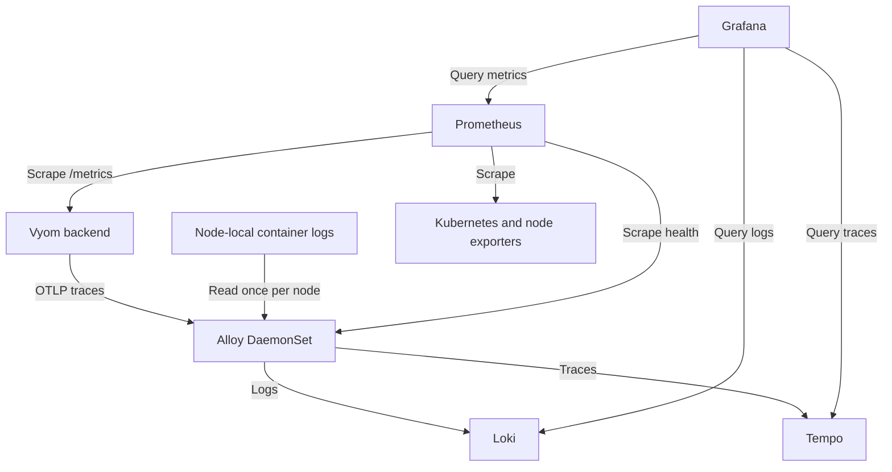

# Observability from S1

Owner requirement, 2026-10-04: Loki, Prometheus, Grafana and OpenTelemetry-based tracing belong in the first working project. This is a planned design; runtime and telemetry remain undelivered. The [constitution](../vyom-12-week-sprint-plan.md) governs scope; [implementation tasks](IMPLEMENTATION_PLAN.md) carry budgets and gates.

## Initial stack

| Component | Responsibility | Initial deployment |
|---|---|---|
| Prometheus | Cluster/app metrics, request/tool/provider rates, errors and latency | Single instance with PVC; pinned kube-prometheus-stack includes operator, kube-state-metrics and node exporter |
| Loki | Sanitized application and allowlisted container logs | Single-binary mode, PVC, short retention |
| Tempo | Store/query OpenTelemetry traces | Monolithic mode, PVC, short retention; verify pinned chart/image compatibility |
| Grafana | Cluster and Vyom dashboards; metric/log/trace exploration | One instance from kube-prometheus-stack; provision data sources/dashboards as code |
| Grafana Alloy | Node-local logs and OTLP trace reception/processing/export | DaemonSet, internal OTLP Service, bounded buffers and read-only log mounts |
| OTel SDK | Request, graph-step, model-client, MCP-client and collector spans | Inside the existing backend |

Alloy supports native OpenTelemetry pipelines and OTLP reception, so it fills the collector role. Prometheus owns metric scraping; Alloy owns logs and trace forwarding. Do not collect the same stdout stream through a second OTLP log pipeline. Use `vyom` and `observability` namespaces, one application chart and pinned vendor releases in a single reproducible Kind/EKS workflow. Disable unused chart components; avoid a second Grafana or a distributed stack in S1.

## Collection topology

Arrows represent collection/export or query initiation, not application request dependencies.

Filter log discovery to each collector's node and allowlisted namespaces/workloads. Verify upstream MCP debug/payload logging is disabled before collecting its logs. Log mounts and discovery permissions give an infrastructure observer access: use a separate, minimally privileged ServiceAccount, never the agent identity. This does not expand MCP tool access.

## First instrumentation and views

Trace HTTP request → owned LangGraph steps → outgoing model/MCP clients → evidence normalization → response using stable span names and W3C context. Verify upstream MCP propagation/internal spans only where supported by the pinned server; external provider internals are not promised. Instrument direct collectors as added.

Use sanitized JSON logs with service, operation, outcome, `trace_id` and `span_id`. Trace/request/session/resource IDs belong in log fields or structured metadata, not metric or Loki indexed labels. Bound metric dimensions to route templates, configured tool/server IDs, provider/model and outcome. Disable prompt/completion/tool-body capture; strip credentials, sensitive headers/URL queries, raw prompts/answers/tool results, literal pod env and unsafe exception text at the source.

Provision two dashboards: cluster CPU/memory/readiness/restarts/availability/scrape health, and Vyom request/graph/model/tool latency/errors plus collector freshness/export health. Provider-reported token usage is useful when available; unavailable is not zero. Provision Loki-to-Tempo and Tempo-to-Loki links by trace ID/service/time. Metrics are aggregate; metric exemplars are optional, not a claim that every sample identifies a request.

The S2 Metrics Server/CloudWatch product views remain separate source paths. CloudWatch-to-Prometheus export and agent queries of the telemetry stores are later scope.

## Progressive delivery

| Sprint | Required increment |
|---|---|
| S1 | Entire stack on Kind; start with 48-hour retention, bounded PVC/resources/buffers and 100% tracing for small demo traffic with volume limits; two dashboards and real correlated chat/failure proof |
| S2 | Same pins on EKS with validated storage/resources; repeat S1 gates, instrument AWS SDK/MCP clients; label inaccessible managed control-plane targets |
| S3 | Instrument Bedrock/embeddings, retrieval, database/vector clients and jobs as added; no raw query/vector/document capture |
| S4 | Investigation/cost-path timings and outcomes; Jev spans if implemented/enabled |
| S5 | Measure sizing, tune sampling/retention, select durable object storage where needed; tested alerts and telemetry recovery |
| S6 | Decide operator-only versus tenant-visible telemetry; enforce current grants on exposed queries/proxies and Grafana access before shared login/exposure |

These are initial sizing choices, not measured results. Pin versions and verify retention/compaction/storage/upgrade support. Current Tempo mode documentation distinguishes Kafka-free monolithic operation from Kafka-dependent microservices operation; verify the selected release instead of adding Kafka from generic deployment examples. PVCs are not backup or HA.

Grafana uses private authenticated localhost port-forward access and privately injected credentials before Keycloak. Stores and OTLP endpoints stay internal; internal Services alone do not provide authentication or tenant isolation. S6 must not equate a tenant label/filter with authorization over shared operator telemetry.

Use bounded asynchronous export/queues/retries so telemetry outage neither blocks chat nor grows memory indefinitely. Record drops and recovery; complete span delivery during outages is not promised. Verify collector failure independently through Prometheus scrape health and Kubernetes status.

## S1 live gate

1. Clean Kind install with recorded pins, private credentials and real cluster metrics/logs; synthetic OTLP smoke spans prove setup only.
2. Real browser question through compatible model, LangGraph and upstream Kubernetes MCP; retain existing evidence/RBAC gates.
3. Inspect applicable request metrics, sanitized logs and the actual owned-component trace in Grafana; record trace ID and demonstrate both log/trace navigation directions.
4. Induce a provider or MCP failure; verify explicit product outcome plus applicable error metrics/logs/span status.
5. Interrupt telemetry separately; prove bounded application behavior, independently observable loss and recovery. Inspect stored signals for prohibited fields and duplicate ingestion.
6. Record exact commands/queries, versions, environment, time window and limits. Repeat on EKS in S2.

## Primary sources checked 2026-10-04

- [Alloy overview](https://grafana.com/docs/alloy/latest/) and [OTel collection](https://grafana.com/docs/alloy/latest/collect/opentelemetry-data/).
- [Alloy Kubernetes logs](https://grafana.com/docs/alloy/latest/collect/logs-in-kubernetes/).
- [Loki monolithic Helm deployment](https://grafana.com/docs/loki/latest/setup/install/helm/install-monolithic/) and [filesystem limitations](https://grafana.com/docs/loki/latest/operations/storage/filesystem/).
- [Tempo deployment modes](https://grafana.com/docs/tempo/latest/set-up-for-tracing/setup-tempo/plan/deployment-modes/) — recheck chart/image mode at implementation.
S1.9 must inspect the selected [kube-prometheus-stack release](https://github.com/prometheus-community/helm-charts/tree/main/charts/kube-prometheus-stack), chart defaults and values directly. GitHub source retrieval was unavailable during this source check; exact release and installed components remain implementation inputs.

Source review is not deployed acceptance. The [interactive overview](diagrams/application.html), [dedicated collection view](diagrams/observability.html) and Mermaid architecture sources reflect this revision; see [diagram verification limits](diagrams/README.md).
